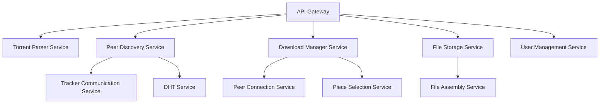

Approaching a torrent downloader from a microservice architecture perspective is an interesting way to modularize the system and potentially make it more scalable and maintainable. Here's a breakdown of potential microservices for a torrent downloading system:

Let's break down each of these services and their responsibilities:

1. API Gateway:
    - [ ] Handles external requests
    - [ ] Routes requests to appropriate microservices
    - [ ] Manages authentication and rate limiting

2. Torrent Parser Service:
    - [x] Parses .torrent files and magnet links
    - [x] Extracts metadata (file info, trackers, piece hashes)

3. Peer Discovery Service:
    - [x] Coordinates peer discovery methods
    - [ ] Interfaces with Tracker Communication and DHT services

4. Tracker Communication Service:
    - [x] Communicates with trackers to get peer lists
    - [x] Handles tracker protocol specifics

5. DHT (Distributed Hash Table) Service:
    - [ ] Implements DHT protocol for trackerless torrents
    - [ ] Manages DHT node connections and queries

6. Download Manager Service:
    - [x] Orchestrates the overall download process
    - [x] Manages download queues and priorities

7. Peer Connection Service:
    - [x] Establishes and manages connections to peers
    - [x] Implements BitTorrent protocol messaging

8. Piece Selection Service:
    - [x] Implements piece selection algorithms (e.g., rarest first)
    - [x] Tracks piece availability across peers

9. File Storage Service:
    - [x] Handles writing downloaded pieces to disk
    - [x] Manages file allocation and disk space

10. File Assembly Service:
    - [x] Assembles downloaded pieces into complete files
    - [x] Verifies file integrity

11. User Management Service:
    - [ ] Handles user accounts, if applicable
    - [ ] Manages user preferences and download history

Each of these services could be implemented as a separate microservice, potentially in different languages or using different technologies as appropriate. They would communicate via APIs, possibly using REST or gRPC.

Key considerations for this architecture:

1. Service Discovery: Implement a way for services to find and communicate with each other.

2. Data Consistency: Ensure data consistency across services, especially for shared state like download progress.

3. Fault Tolerance: Design each service to be resilient and the overall system to handle partial failures.

4. Scalability: Design services to be independently scalable based on load.

5. Monitoring and Logging: Implement comprehensive logging and monitoring across all services.

6. Security: Ensure secure communication between services and proper access controls.

7. Testing: Implement thorough unit and integration testing for each service and the system as a whole.

